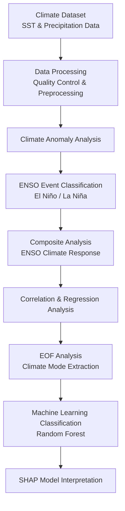

# Climate Data Analysis and Visualization

A Python-based climate data analysis project focusing on **ENSO (El Niño–Southern Oscillation)** variability through statistical analysis, climate visualization, and machine learning approaches.

This repository contains workflows developed for climate data analysis, including anomaly analysis, composite analysis, regression modeling, EOF analysis, and machine learning-based ENSO classification.

---

## Project Overview

This project explores climate variability associated with ENSO events using Python-based scientific computing and statistical methods.

The analysis workflow includes:

- Climate anomaly calculation
- ENSO event identification
- Composite analysis and significance testing
- Correlation and regression analysis
- Spatial climate pattern analysis
- EOF decomposition
- Machine learning classification
- Model interpretation using SHAP

---

# Repository Structure

| Folder | Description |
|---|---|
| [01_Climate_Anomaly_Analysis](./01_Climate_Anomaly_Analysis) | Climate climatology and anomaly analysis |
| [02_Composite_Analysis_and_Significance_Test](./02_Composite_Analysis_and_Significance_Test) | ENSO event classification, composite analysis, and statistical significance testing |
| [03_Correlation_and_Regression_Analysis](./03_Correlation_and_Regression_Analysis) | Climate correlation analysis and regression modeling |
| [04_Regression](./04_Regression) | Regional and seasonal regression analysis |
| [05_Visualization_and_Clustering](./05_Visualization_and_Clustering) | Climate visualization and clustering methods |
| [06_EOF](./06_EOF) | EOF and XEOF analysis for climate pattern extraction |
| [07_ENSO_Prediction](./07_ENSO_Prediction) | Statistical ENSO prediction models |
| [08_MachineLearning_Classification](./08_MachineLearning_Classification) | Machine learning classification using Decision Tree and Random Forest |
| [09_ENSO_ML_Classification](./09_ENSO_ML_Classification) | Random Forest ENSO classification with SHAP interpretation |

---

# Methodologies

## Climate Data Analysis

- Climate anomaly calculation
- SST anomaly analysis
- ENSO event classification
- Composite analysis
- Statistical significance testing

## Statistical Modeling

- Pearson correlation analysis
- Linear regression
- Regional regression
- Seasonal regression

## Climate Dynamics

- ENSO variability analysis
- Atmospheric teleconnection patterns
- EOF decomposition
- XEOF analysis

## Machine Learning

Implemented models:

- Decision Tree
- Random Forest
- SHAP explainability analysis

---

# Technical Skills

## Programming Language

- Python

## Scientific Computing Libraries

- NumPy
- Pandas
- Xarray
- Matplotlib
- Cartopy
- Scikit-learn

---

## Project Workflow

---

# Key Topics

## ENSO Climate Variability

This project investigates:

- El Niño and La Niña events
- Tropical Pacific SST anomalies
- Climate teleconnection patterns
- Spatial climate variability

## Machine Learning Interpretation

Random Forest models are combined with SHAP analysis to identify important climate variables contributing to ENSO classification.

---

## Author

**Shih Hsiang (Gabriel) Huang**

Interested in climate modeling, energy systems, sustainable finance, non-financial analysis, and data-driven approaches for climate and environmental research.

LinkedIn: www.linkedin.com/in/gab-huang